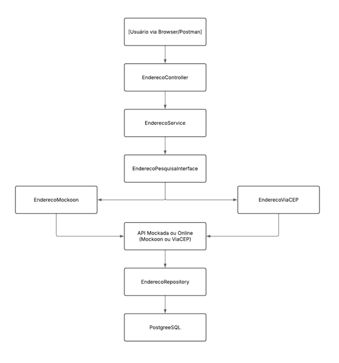

# Projeto Busca CEP - Desafio Santander

Este projeto permite buscar informações de um CEP usando uma API externa (ViaCEP)
ou uma API Mockada (Mockoon) e salvar os dados em um banco de dados (no caso usado 
o PostgreeSQL), seguindo os princípios do SOLID.

# Arquitetura do Projeto

## Como executar
./mvnw spring-boot:run

Usando perfil de PROD (Online ViaCEP): 
SPRING_PROFILES_ACTIVE=prod ./mvnw spring-boot:run
